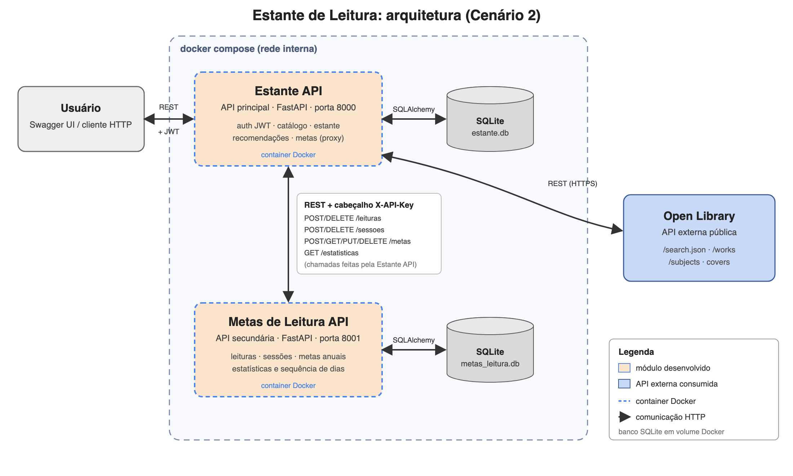

# 🎯 Metas de Leitura API

API secundária do projeto **Estante de Leitura**. Guarda o **histórico de leitura** de cada usuário
(livros concluídos e páginas lidas por dia) e calcula **metas anuais** e **estatísticas**:
progresso da meta, ritmo necessário, sequência de dias lendo, livros por mês e por gênero.

Ela é consumida pela **[Estante API](https://github.com/lucasmelomcg/estante-api)** (API principal),
que chama estas rotas automaticamente quando o usuário atualiza a estante.

---

## 🏛️ Arquitetura



- Comunicação: **REST** (JSON), a partir da Estante API.
- Segurança: todas as rotas, exceto `/health`, exigem o cabeçalho **`X-API-Key`** com a chave
  interna compartilhada com a Estante API.
- Persistência: **SQLite** próprio (`metas_leitura.db`), separado do banco da API principal.

---

## 🛣️ Rotas

Documentação interativa (Swagger): **http://localhost:8001/docs**. No Swagger, clique em
**Authorize** e informe a chave (padrão de desenvolvimento: `chave-interna-dev`).

| Método | Rota | Descrição |
|---|---|---|
| POST | `/leituras` | Registra (ou atualiza) a conclusão de um livro |
| GET | `/leituras?usuario_id=&ano=` | Lista os livros concluídos |
| DELETE | `/leituras/{usuario_id}/{livro_ref}` | Remove a conclusão de um livro |
| POST | `/sessoes` | Registra páginas lidas em um dia |
| GET | `/sessoes?usuario_id=&livro_ref=&ano=` | Lista as sessões de leitura |
| DELETE | `/sessoes/{usuario_id}/{livro_ref}` | Remove as sessões de um livro |
| POST | `/metas` | Cria a meta de um ano |
| GET | `/metas/{usuario_id}/{ano}` | Consulta a meta |
| PUT | `/metas/{usuario_id}/{ano}` | Altera a meta |
| DELETE | `/metas/{usuario_id}/{ano}` | Remove a meta |
| GET | `/estatisticas/{usuario_id}?ano=` | Estatísticas e progresso da meta |
| GET | `/health` | Verifica se a API está no ar (sem chave) |

### Como as estatísticas são calculadas

| Campo | Regra |
|---|---|
| `livros_concluidos` | Leituras com `data_conclusao` no ano |
| `paginas_lidas` | Soma das sessões de leitura do ano |
| `sequencia_atual_dias` | Dias consecutivos com sessão até hoje. Continua valendo se o usuário leu ontem e ainda não leu hoje. |
| `maior_sequencia_dias` | Maior sequência de dias consecutivos já registrada |
| `meta.livros_esperados_ate_hoje` | `meta_livros × fração do ano já passada` |
| `meta.ritmo_necessario_livros_por_mes` | `livros restantes ÷ meses restantes` (contando o mês atual) |
| `meta.situacao` | `meta_batida`, `adiantado` (≥ 1 livro à frente do esperado), `no_ritmo`, `atrasado` ou `nao_iniciada` (ano futuro) |

### Exemplo de resposta de `GET /estatisticas/1?ano=2026`

```json
{
  "usuario_id": 1,
  "ano": 2026,
  "livros_concluidos": 1,
  "paginas_lidas": 268,
  "media_nota": 5.0,
  "sequencia_atual_dias": 1,
  "maior_sequencia_dias": 1,
  "meta": {
    "meta_livros": 10,
    "meta_paginas": 3000,
    "progresso_livros_percentual": 10.0,
    "progresso_paginas_percentual": 8.9,
    "livros_restantes": 9,
    "livros_esperados_ate_hoje": 7.4,
    "ritmo_necessario_livros_por_mes": 2.25,
    "situacao": "atrasado"
  },
  "por_mes": [{ "mes": 1, "livros": 0, "paginas": 0 }, "..."],
  "por_genero": [{ "genero": "Ficção", "livros": 1 }]
}
```

---

## 🚀 Como executar

### Pré-requisitos

- [Docker](https://docs.docker.com/get-docker/)
- (Opcional, para rodar sem Docker) [Python 3.12+](https://www.python.org/downloads/)

### Opção 1: junto com a Estante API (recomendada)

O `docker-compose.yml` fica no repositório da **Estante API** e sobe as duas APIs juntas.
Clone os dois repositórios lado a lado e siga as instruções do README da Estante API:

```bash
git clone https://github.com/lucasmelomcg/estante-api.git
git clone https://github.com/lucasmelomcg/metas-leitura-api.git
cd estante-api && docker compose up --build
```

### Opção 2: só esta API, com Docker

```bash
docker build -t metas-leitura-api .
docker run -d --name metas-leitura-api -p 8001:8001 \
  -e API_KEY=chave-interna-dev \
  -v metas-dados:/app/data \
  metas-leitura-api
```

Acesse http://localhost:8001/docs

### Opção 3: localmente, sem Docker

```bash
python -m venv .venv
source .venv/bin/activate          # Windows: .venv\Scripts\activate
pip install -r requirements.txt
cp .env.example .env
uvicorn app.main:app --reload --port 8001
```

### Variáveis de ambiente

| Variável | Padrão | Descrição |
|---|---|---|
| `DATABASE_URL` | `sqlite:///./data/metas_leitura.db` | Conexão com o banco |
| `API_KEY` | `chave-interna-dev` | Chave exigida no cabeçalho `X-API-Key`. **Troque em produção.** |

---

## ✅ Testes automatizados

```bash
pip install -r requirements-dev.txt
pytest
```

---

## 📁 Estrutura do projeto

```
metas-leitura-api/
├── app/
│   ├── main.py                 # criação da aplicação FastAPI e registro das rotas
│   ├── config.py               # configurações (variáveis de ambiente)
│   ├── database.py             # conexão SQLAlchemy
│   ├── models.py               # tabelas: leituras_concluidas, sessoes_leitura, metas_anuais
│   ├── schemas.py              # modelos Pydantic de entrada e saída
│   ├── security.py             # validação do cabeçalho X-API-Key
│   ├── routers/                # rotas (leituras, sessoes, metas, estatisticas)
│   └── services/
│       └── estatisticas.py     # cálculo de metas, ritmo e sequências
├── tests/                      # testes com pytest
├── docs/arquitetura.png        # fluxograma da arquitetura
├── Dockerfile
├── requirements.txt
└── requirements-dev.txt
```

---

## 🧰 Tecnologias

Python 3.12 · FastAPI · SQLAlchemy 2 · SQLite · Pydantic 2 · Pytest · Docker
